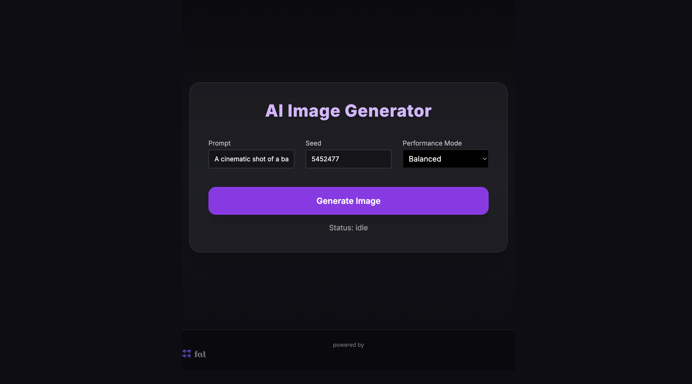

## AI Image Generator — FastAPI + Next.js (Flux Schnell by fal.ai)

Modern AI Image Generator built with Next.js, FastAPI, and fal.ai's Flux Schnell model.
This project demonstrates a real-time async job queue system where the backend generates images and the frontend polls for results — all with a polished UI.

## How It Works

1. You enter a prompt, choose a performance mode, and set a seed.
2. The request is sent to the FastAPI backend (/submit-job).
3. A background async task calls fal.ai / flux-schnell to generate the image.
4. The frontend polls the backend every 1.5 seconds.
5. When the job is complete, the generated image is shown instantly.

## Prerequisites

You need a Fal AI API Key.

Create one here:
👉 https://fal.ai/

## Setup Instructions
1. Clone the repository

git clone https://github.com/sunilganta-dev/fal-realtime-enhanced
cd fal-realtime-enhanced

## Backend Setup (FastAPI)

1. Create virtual environment

    python3 -m venv venv
    source venv/bin/activate

2. Install backend dependencies

pip install fastapi uvicorn fal-client aiohttp

3. Set your fal API key

export FAL_KEY="your_api_key_here"

4. Run FastAPI server

uvicorn main:app --reload --port 8000

5. Backend will run at:  http://localhost:8000

## Frontend Setup
1. npm install
2. Add your fal API key to .env.local (FAL_KEY=your_api_key_here)
3. Run the development server(npm run dev )
4. Frontend will run at: http://localhost:3000

